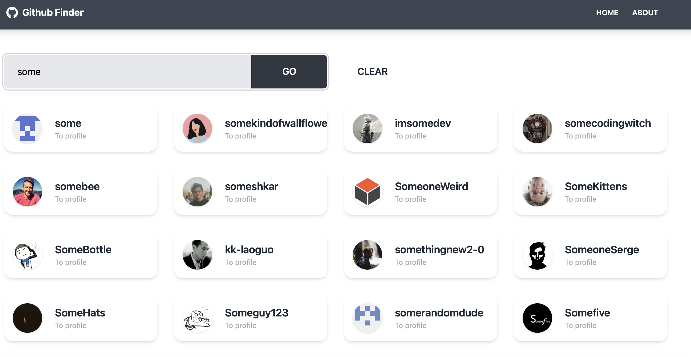

## Overview

## Preparation steps:

Clone repository, then in the project directory, you can run:

### `npm install`

### `npm start`

Runs the app in the development mode.\
Open [http://localhost:3000](http://localhost:3000) to view it in your browser.

## Demo

See the [demo](https://github-finder-henna-eight.vercel.app)

